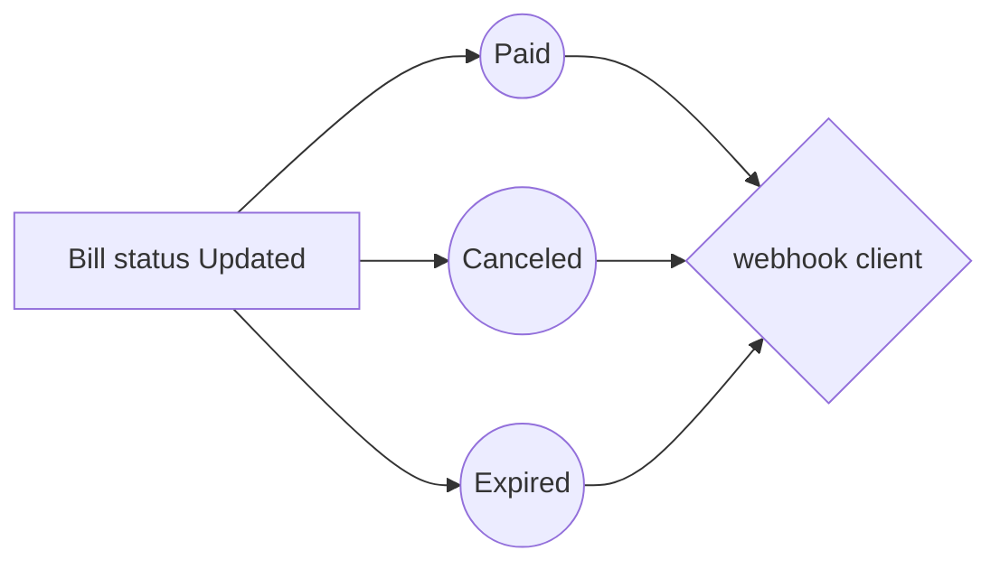

# How integrate with Sure Bills
after [register](https://bills.surepay.sa/register) in sure bills and complete your account.

## Create Integration Application and Get  Credentials


 1. Go to integration page [integration](https://bills.surepay.sa/integration).
 2. Create new application with [**name**, **redirect url**, **webhook url**].
 3. Get  Credentials After Submit you will see new **secert** and **webhook secret**. 
 
> make sure the **Redirect Url** and **Webhook Url** are existing url in your application.

> webhook server sensitive if url in **https** or **http**.


## integrate 

### Create bill
To create the bill, send the `payment` object to SureBills. This action provides a redirect URL to which to redirect the customer. After the customer accepts the payment, SureBills redirects the customer to the **Redirect URL**.


#### Define payment
To define the payment, create a  `payment`  object, which sets:

 1. SureBills Credentials from application **Id** and **secret**
 2. The transaction details
```json
{
   //Credentials
    "application_id": "47",
    "application_secret": "cJTgqZG0ktOn69BxMt7G",
   
   //transaction details
    "reference_id": "id",
    "customer_name": "jone due",
    "customer_email": "jone_due@email.com",
    "customer_mobile": "500000001",
    "customer_notes": "notes",
    "expiry_date": 3,
    "expiry_hours": 30,
    "expiry_minutes": 15,
    "due_date": "20-3-2021",
    "items":[
        {
            "name": "item name",
            "price": 300,
            "quantity": 2
        }
    ],
    "send_sms": "off",
    "send_email": "on",
    
    "add_discount": "on",
    "discount_type": "percentage", //fixed or percentage
    "discount_value": 10,
    
    "add_tax": "on",
    "tax_name": "general",
    "tax_value": 5,
   
}
  ```
  #### Create payment
  After you define the  `payment`  object in previous step, use it to create the Bill:
 - create `post` request to sure bills `/api/v1/bills/create`
 - make request body `payment`  object
 - Redirect the customer to this Direct URL
 
 #### Execute payment
After the customer accepts the payment, your app redirects the customer to the `redirect url`  that you defined in the appllication.

If the customer Pay the Bill, you can check the Bill.

To check the bill, set the Bill ID and Credentials parameters in the `get` request:

    /api/v1/bills/{bill_id}?application_secret={SECRET}&application_id={ID}
    
```php
    //check if status Paid
    if($payload['data']['status'] == 'paid'){
        //code. here
    }
```
## Handel Webhook call

 - webhooks use the `post` method
 - sure bills add a **header** called `Signature` that will contain a signature.
 - webhook send body request that will contain:
```php
        'reference_id' => (string) id,  //bill status
        'status' => (string) status,    //bill status 
        'bill_id' => (string) uuid,     //bill id 
        'total' => (int) 16056,         //total anount of bill
        'pay_url' => (string) link,     //
  ```
- to check webhook hashed data in `Signature` by your `webhook secret` .

```php
    $payloadJson = json_encode($payload)); 
    $signature = hash_hmac('sha256', $payloadJson, webhook_secret);
    if($signature == $_SERVER['HTTP_SIGNATURE']){
        //code here
    }
``` 

## flow chart

And this will produce a flow chart:




